# 🚗 Car Damage Detection using Optimized VGG16 CNN

An AI-powered desktop application that automatically detects and classifies vehicle damage from images using an optimized VGG16 Convolutional Neural Network (CNN). The project combines deep learning, computer vision, and a modern desktop interface to assist with vehicle inspection by providing damage predictions, confidence scores, and model evaluation.

> 🎓 **Final Year Project**  
> Bachelor of Computer Science (Software Engineering)  
> Universiti Malaysia Pahang Al-Sultan Abdullah (UMPSA)

---

# 📸 Application Preview

    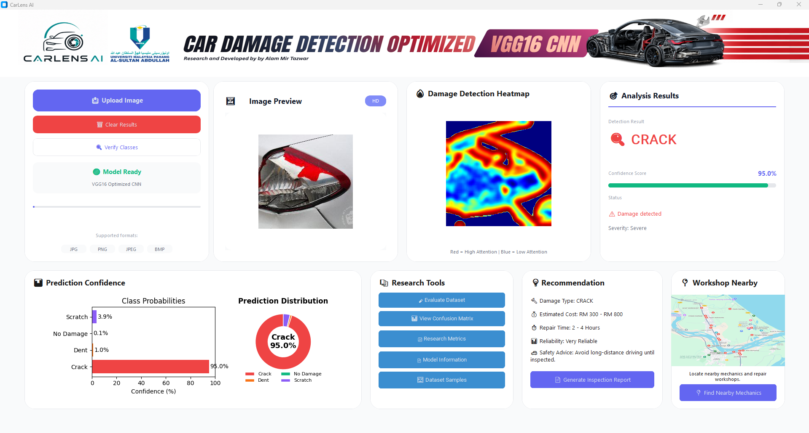

<b>Real-time AI-powered vehicle damage detection through an interactive desktop application.</b>

---

# 📖 Project Overview

Vehicle damage inspection is traditionally performed manually, making the process time-consuming, subjective, and prone to human error. This project applies deep learning and computer vision techniques to automate vehicle damage classification, providing a faster and more consistent inspection process.

The application classifies vehicle images into four categories:

- 🚗 Crack
- 🚗 Dent
- 🚗 Scratch
- 🚗 No Damage

The trained Optimized VGG16 CNN model is integrated into a desktop application developed with CustomTkinter, allowing users to upload vehicle images, perform real-time predictions, visualize confidence scores, and review model evaluation results.

---

# ✨ Key Features

- 🤖 AI-powered vehicle damage classification
- 🧠 Optimized VGG16 CNN using Transfer Learning
- 🖥️ Interactive desktop GUI
- 📷 Vehicle image upload and prediction
- 📊 Confidence score visualization
- 📈 Model performance evaluation
- 📄 Vehicle inspection report generation
- 📚 Dataset visualization
- 🔬 Research evaluation tools

---

# 🖼️ GUI Showcase

## Dashboard

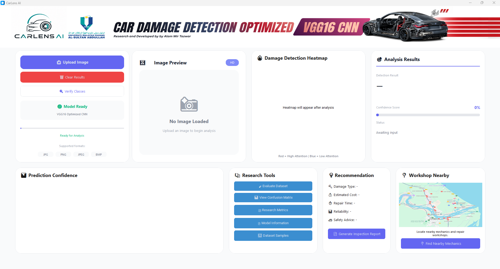

---

## Vehicle Image Selection

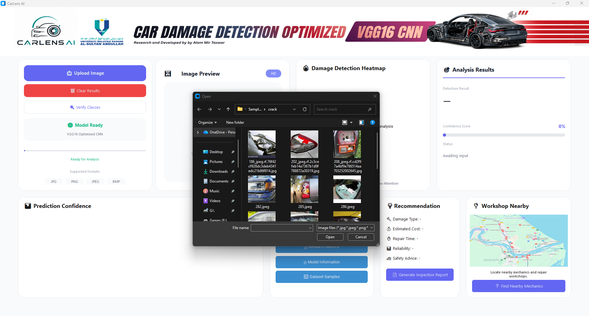

---

## Prediction Result

---

## Vehicle Inspection Report

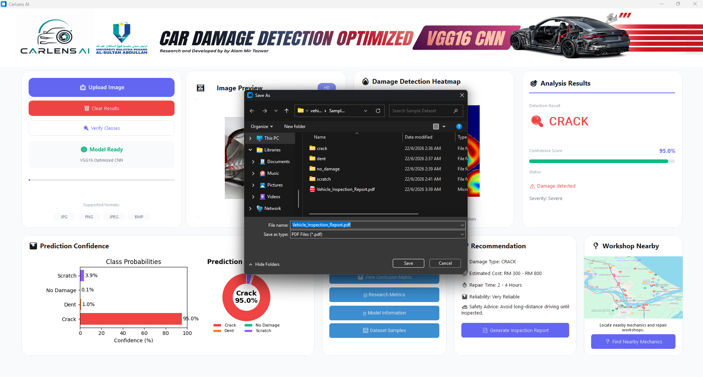

---

# 📊 Evaluation Dashboard

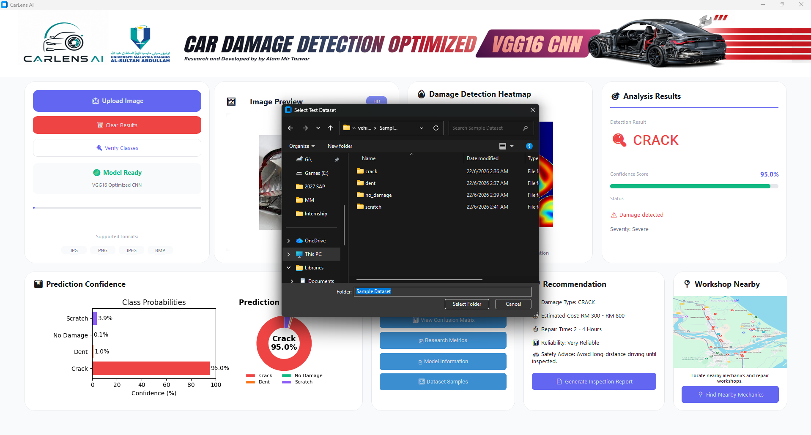

The evaluation dashboard summarizes prediction performance, classification results, and overall model evaluation metrics to assess the effectiveness of the trained CNN model.

---
## Confusion Matrix

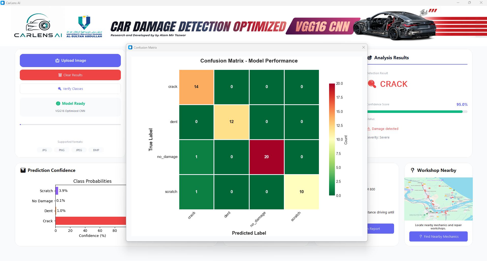

---

# 📂 Dataset

## Dataset Samples

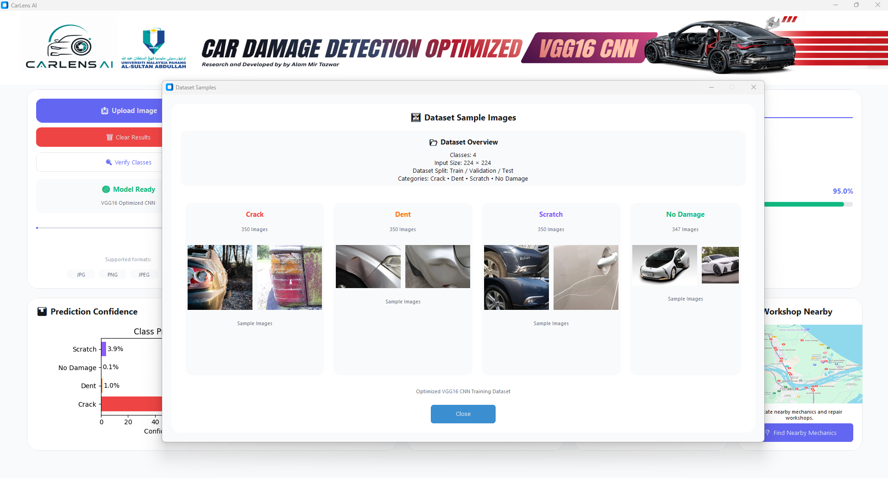

The model was trained and evaluated using four vehicle damage categories:

- Crack
- Dent
- Scratch
- No Damage

---

# 🤖 AI Model

## Model Information

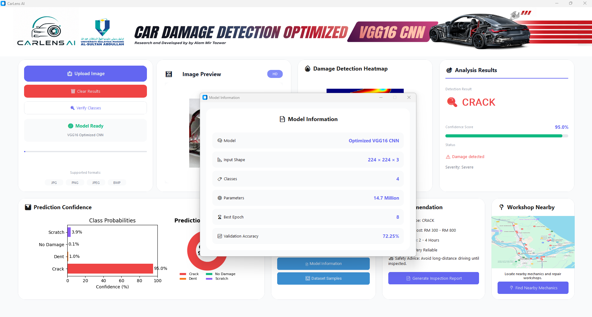

---

## Model Performance

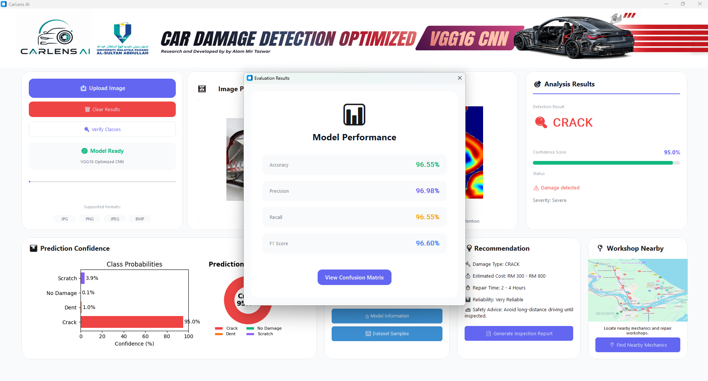

---

# 💻 GUI Source Code

The desktop application was developed using **Python** and **CustomTkinter**, providing an intuitive graphical interface for vehicle image upload, AI prediction, confidence visualization, model evaluation, and report generation. The GUI communicates directly with the trained VGG16 model to perform real-time vehicle damage classification.

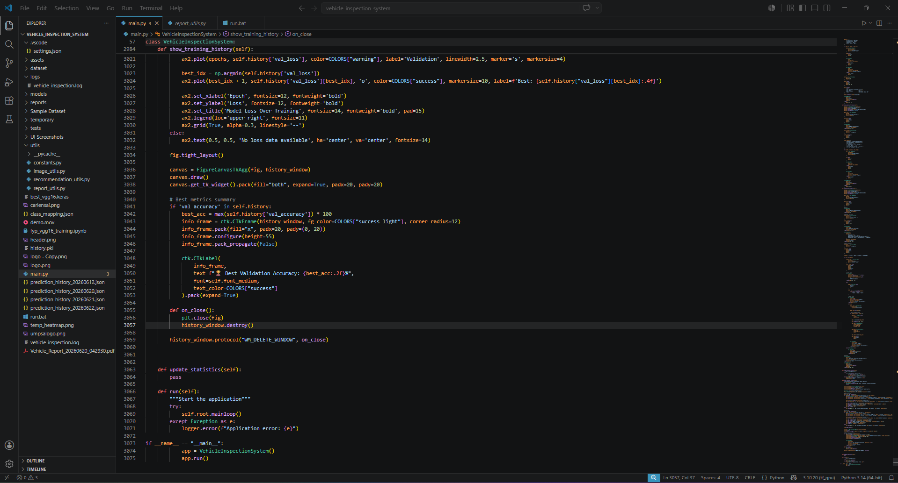

---

## Training Process

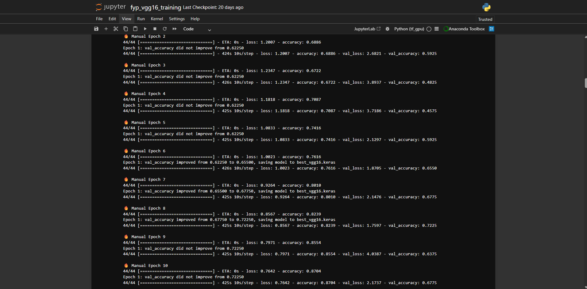

---

# 🛠️ Technology Stack

### Programming Language

- Python

### Deep Learning

- TensorFlow
- Keras

### Computer Vision

- OpenCV

### Machine Learning

- Scikit-learn

### GUI Development

- CustomTkinter
- Tkinter

### Data Processing

- NumPy
- Pandas

### Data Visualization

- Matplotlib

### Development Environment

- Anaconda
- Jupyter Notebook

---

# 📌 Future Improvements

- Improve classification accuracy using a larger and more diverse dataset.
- Expand support for additional vehicle damage categories.
- Deploy the application as a web-based platform.
- Integrate Explainable AI techniques such as Grad-CAM.
- Develop a mobile-friendly version for field inspections.

---

# 👨‍💻 Author

**Alam Mir Tazwar**

Bachelor of Computer Science (Software Engineering)

Universiti Malaysia Pahang Al-Sultan Abdullah (UMPSA)

Final Year Project • 2026

---

⭐ If you found this project interesting, consider giving this repository a star.
